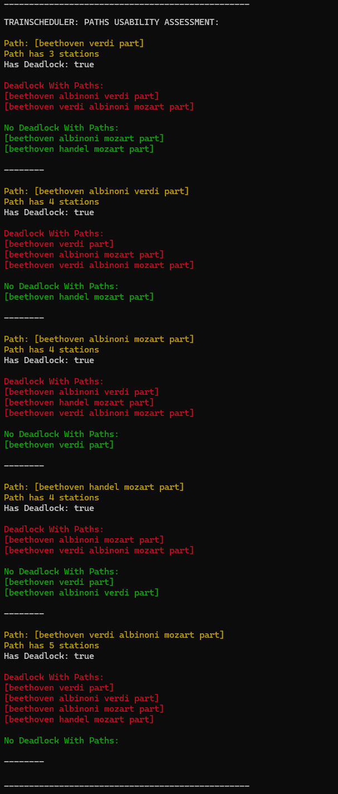
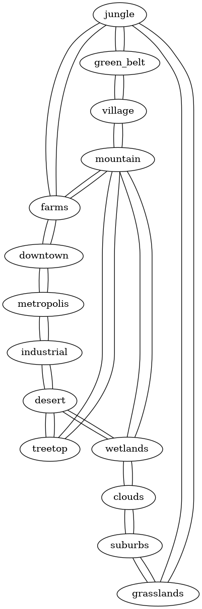

## Stations Patfinder

[Click-through video >>](https://www.youtube.com/watch?v=MLnwvOu_-Rk)

### Usage:

-  go run . "path to map" "start station" "end station" "number of trains" *OPTIONAL 6th arg for logging: "log"
    
    For example:
    ```go
    // Standard mode
    go run . ./map2.txt jungle desert 10

    // or

    // Logging mode (NB! Needs Graphwiz installed - see below)
    go run . ./map2.txt jungle desert 10 log
    ```
- To install Graphwhiz (which allows graph.png generation and makes it easier to visualize the map), do this in terminal:
    ```go
    // For WSL users

    sudo apt-get install graphviz

    // For Mac users

    brew install graphviz
    ```
- NB: With very large maps the output logging may be very long - to allow checking and monitoring the process throughout the callstack and different helper functions.

### Test cases for review:

- It completes the movements in no more than 6 turns for 4 trains between bond_square and space_port:

    ```go
    go run . ./map.txt bond_square space_port 4
    // or
    go run . ./map.txt bond_square space_port 4 log
    ```
- It displays "Error" on stderr when a map contains more than 10000 stations:

    ```go
    go run . ./maplarge.txt 1 2 5
    // or
    go run . ./maplarge.txt 1 2 5 log
    ```
- It finds more than one valid route for 100 trains between waterloo and st_pancras in the London Network Map:

    ```go
    go run . ./map5.txt waterloo st_pancras 100
    // or
    go run . ./map5.txt waterloo st_pancras 100 log
    ```
- It completes the movements in no more than 6 turns for 9 trains between beethoven and part:

    ```go
    go run . ./map6.txt beethoven part 9
    // or
    go run . ./map6.txt beethoven part 9 log
    ```
- It completes the movements in no more than 11 turns for 20 trains between beginning and terminus:

    ```go
    go run . ./map7.txt beginning terminus 20
    // or
    go run . ./map7.txt beginning terminus 20 log
    ```
- It completes the movements in no more than 6 turns for 4 trains between two and four:

    ```go
    go run . ./mapnumbers.txt two four 4
    // or
    go run . ./mapnumbers.txt two four 4 log
    ```
- It can find more than one route for 2 trains between waterloo and st_pancras for the London Network Map:

    ```go
    go run . ./map5.txt waterloo st_pancras 2
    // or
    go run . ./map5.txt waterloo st_pancras 2 log
    ```
- It finds more than one valid route for 3 trains between waterloo and st_pancras in the London Network Map:

    ```go
    go run . ./map5.txt waterloo st_pancras 3
    // or
    go run . ./map5.txt waterloo st_pancras 3 log
    ```
- It finds more than one valid route for 4 trains between waterloo and st_pancras in the London Network Map:

    ```go
    go run . ./map5.txt waterloo st_pancras 4
    // or
    go run . ./map5.txt waterloo st_pancras 4 log
    ```
- It finds only a single valid route for 1 train between waterloo and st_pancras in the London Network Map:

    ```go
    go run . ./map5.txt waterloo st_pancras 1
    // or
    go run . ./map5.txt waterloo st_pancras 1 log
    ```
- It completes the movements in no more than 8 turns for 10 trains between jungle and desert:

    ```go
    go run . ./map2.txt jungle desert 10
    // or
    go run . ./map2.txt jungle desert 10 log
    ```
- It completes the movements in no more than 8 turns for 9 trains between small and large:

    ```go
    go run . ./map3.txt small large 9
    // or
    go run . ./map3.txt small large 9 log
    ```

### Design logic:

- Trying to plan and execute it as if it were a real life mission-critical service.
- Inputs are validated and as much prepping and validation is done before the main algorithm will do its work.
- The goal would be that there is as little abstraction as possible - which is hard to see and debug - In addition, the "log" mode prints out most of the program flow and intermediate steps for program output validation (+ generates a png for the map - to visualize the map, which makes it easier to debug or expand the program logic).
- any algorithm shold do as little work as possible and each step should ideally focus only on 1 thing.
- Using BFS only to find the paths and then passing the logic to a TrainScheduler() func, to have a more robust setup which is more efficient and possibly easier to debug.
- TrainScheduler() will abstract away/set a lot of the map constraints via data from BFS and NOT from input args - because should not inject data up from call stack which has not beed touched by BFS algorithm which is the input for the TrainScheduler().
- We also use the agrument that in real world bandiwth and computing costs actual money, thus we limit the start and end station capacity precisely to match the number of trains, NOT infinity - This could IRL allow us to use signals/logs when all trains have left start or reached end station etc without using additional calcs to check for this:
    
    ```go
	stationOccupancy := make(map[string]int)
	for _, path := range paths {
		for _, station := range path {
			stationOccupancy[station] = 1
		}
	}
	
	stationOccupancy[startTSstation] = numTrains
	stationOccupancy[endTSstation] = numTrains
    ```
- After BFS algo does its job and paths go to scheduler, the scheduler also calls an EvaluatePaths() func, which checks which paths share a station which is not start or end station, and collects deadlocking and non-deadlocking paths into a struct which should help to more easily schedule the train movements. Can also expand this logic, if more stuff needs to be evaluated - evaluation is only printed in "log" mode.

    

- Evaluated paths output is "evaluated again" - findUniqePathCombos() finds a set of paths where there are no shared stationsn/no deadlocks.
- These are then sent to makePathsWithTrains(), which assigns paths either in a round-robin fashion 1 by 1 or when the paths are very different (like the beginning/terminus map), the paths get assigned by their weight ratio. This logic is quite rough atm and optimized for the beginning/terminus map, but weight ratio can be modified and modulo operator can also be modified -> Which assigns paths to trains in a ratio like 2:1 or 3:1, etc - making sure that very short paths are not underutilized and longer paths overutilized. This logic could be expanded a lot IRL, but atm it ensures that no solution is hard-coded and actually determined by the heuristics of the map and paths:

    ```go
    func makePathsWithTrains(forTrainMatching [][]string, numTrains int, logging bool) ([]TrainPaths, error) {

        ...    

        // MOD OP ADJUSTMENT HERE:
            modOp := int(smallestWeight*10) - 1 // setting up a modulo operator to assign paths. Adjusted for 2:1

        ...

        if i%modOp != 0 || i == 0 { // first train should get shortest path too, but 0 modulo x is zero
            trainPaths[i] = TrainPaths{
                TrainID: trainID,
                Path:    forTrainMatching[smallPathIndex],
            }
        } else if i%modOp == 0 && i != 0 { // first train should get shortest path too, but 0 modulo x is zero
            trainPaths[i] = TrainPaths{
                TrainID: trainID,
                Path:    forTrainMatching[bigPathIndex],
            }
        }

        ...

    }
    ```

- General logic is that paths with deadlock potential are not worth using, because it does not save moves, when trains have to wait in a deadlock station and stations behind them are filled.
- MakeTraffic(), which generates the basis for the final otput is turn-based not train-based, as this aligns more with the needed final output.

### Real world considerations:
- func extractOperation has very robust and limited text formatting:
    
    1. Ignoring comments and inline comments and cleaning up leading and trailing spaces and taking out spaes inbetween.
    2. There is no overly flexible possible handling of malformed map input because IRL it would be a mission-critical piece of software and inut formatting should not be flexible.
    3. Rather, there would be a human-controlled and human-validate preliminary step, where responsible human confirms that map input is valid before the program can continue - might require a separate process for a very large map, but main point is that in such softare cleaning up input cannot == input validation.
    4. When stations or connections have duplicates, using a map takes care of duplicates, but user is still informed in terminal that the source data had aduplicate - they get the same data read in without duplicates, but the program will not fix things (by the map usage)without telling the user that input had invalid data in it.
    5. When connection section lines do not start with a # for comment, or a num, or a lowercase letter - also notify the user.
    6. Main goal - duplicated valid data gets read and user notified, but malformed data gets ignored and user notified - as letting malformed data to pass and program to continue would not be a valid approach for a mission-critical program IRL.

- Graphviz:

    1. generating a .dot to vizualize the graph - seems important IRL to visually check if station map looks OK
    2. Installing:
        ```Go
        // For WSL users

        sudo apt-get install graphviz

        // For Mac users

        brew install graphviz
        ```
    3. Generating the .png is handled by the os/exec package and every time the program executes in "log" mode, the graph.png is recreated - making the map more visually easier to understand.
    4. Example:
    
        


### Stations vs Connections:
- Stations is read into a map with station name as a key and station struct as a value - futureproofing efficiently, as can just expand the struct if need more values for a station (like coordinates, pos future airport connections, capacity etc).
- Connections will go into a bool map (mimicking a set) - because connectios either exist or not and easier to also check for uniqueness as a-b == b-a connection.
- Connections from raw data to maps will use : instead of - for readability and clear signal of which data is used (debugging etc). Also better for differentiation for names with _ where connections with - would be kind of hard to follow in debugging prints.