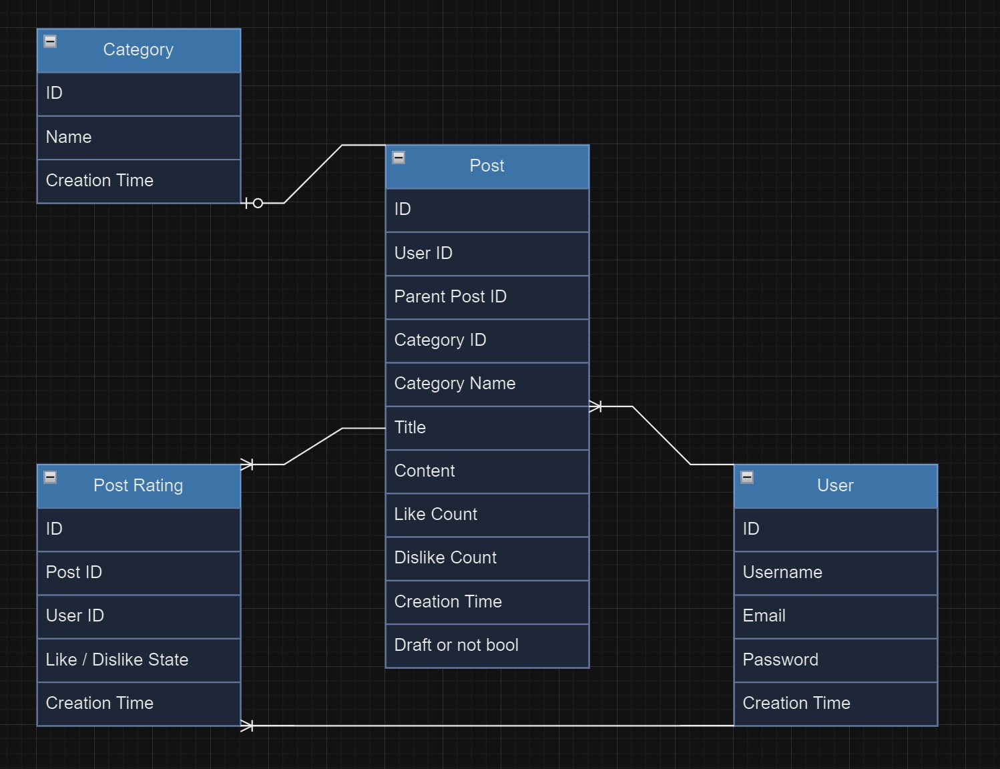

## Go SSR-only Forum with SQLite

*Usage guide and Docker tips in the end of README.*

### Mandatory limitations and rules:

- Using only the Go standard package and Server-Side Rendering (SSR), 
- No JS frameworks allowed for mandatory features.

### Due to this, treating the project with such a scenario and workarounds:

- Building it as if IRL would have no time and resources and need to get basic functionality for v.1 live as soon as possible.
- Grinding out time for backend with a very robust (and ugly but responsive) function-over-form "Sequential Hierarchy" layout design (detailed below).
- Cutting every possible corner (detailed below) and treating the project as a "speed-run" rapid progression towards a bare-bones MVP which does only what is required.
- This also solves the scope creep issue of building things nobody asked for - common and costly scenario IRL.
- The approach reduces the total effort and is a bit more interesting to do.

### TL;DR:

- Did cut every possible corner to get the required minimum features done with least effort possible and project shipped as soon as possible.
- Worked in a limited draft saving feature and robust mobile responsiveness.
- Is responsive and dark mode in default

### Video:

[Click-through video >>](https://www.youtube.com/watch?v=WbvX6C2KNVA)

### Design:

- Dark mode by default - Because people who like light mode dislike dark mode much less than people who like dark mode dislike light mode.

    * Similar to why "Jan 01, 2024" is a good format for dates in web design - People who live in DD MM YYYY regions dislike it much less than MM DD YYYY region people dislike "01 Jan, 2024".
- Responsive by default via "Sequential Hierarchy" ugly but utilitarian design.
- Deliberately not using corner radius for divs and containers and buttons:

    * This would visually clash with the "form over function" overall logic for a speedrun MVP - something that users would not understand clearly but very likely instinctively feel as being "off" for some reason. 

### Sequential Hierarchy:

- Main logic: A responsive but ugly design which requires less vanilla CSS work.
- Base hierarchy on the top-left direction, mirroring common reading and scanning patterns.
- Divs take up predefined space and break to a new line if they exceed the available area.
- Always visible content (logos, navigation items, and tools) closer to top left and conditional content like posts after that. Full length content gets larger divs.
- Post previews do not render content for easier management for v.1.
- Main goal: To minimize any design complexity for speed with the price of an uglier design, but at least responsive.

### Speedrun "No Resources" considerations:

- Implementing a simple like/dislike logic in the model/struct as an integer where 0 is neutral, -1 is dislike, and +1 is like. This setup mimics state management without JavaScript.
- Allowing the authors of posts to assign categories to their own posts, a standard feature on content platforms. This feature comes up when post is actually published - adding categories to drafts just adds complexity with no big upside.
- Not allowing other users to assign their own categories - not a mandatory feature and definitely not a crucial feature for v.1.
- Restricting posts to one category each.
- Intentionally "denormalizing" some data in model structs for simplicity: Carrying some non-std and almost duplicate values which are useful to have without doing additional queries into the db - For example having CategoryName in Post model too when CategoryID is actually needed, or having CreatedAt time in all models.
- Using pre-populated categories to simplify initial setup. Allowing users to create new categories is not crucial initially and can be one of those "on demand" additions IRL.
- Implementing a simple backup system for database initialization failures, notifying the user and logging issues without stopping the service.
- Session management is handled client-side using cookies - proper/modern server-side session management would possibly require external packages.
- Username is needed for all content ending up in db (posts, comments, likes, UI etc.), thus this will be managed server-side.
- As comments are technically posts as well, will build the comments on top of the post handler with specific queries that only fetch posts in relation to their parent post id (if no prent post ID == post | if parent post ID == comment): Will save lots of time and reduces work on likes/dislikes logic.
- Thus comments are modified posts and not needed separately in ERD, nor in models, while still having all the required/mandatory logic/features for users.
- Drafts (extra / not in task requirements): In v.1 users can only save drafts as essence of drafting is storing the work before publishing. Not wasting time for loading drafts into the writer if it can be copy-pasted, nor adding the "delete draft" option. IRL would ship sooner and add these nonessentials in next iteration.

    * A bit similar approach like the Gmail origin story anecdote:

        *Gmail's initial version was created by Paul Buchheit as a side project. It was so basic that it only allowed him to read and search incoming emails. There were no features for composing, sending, or organizing messages. Buchheit's main goal was to prove the concept of a fast, searchable webmail. Despite its limitations, this prototype laid the foundation for what would become Google's revolutionary email service.*

- Not doing any refactoring - during build, no real point to optimize or group duplicated logic. Possibly easier to debug too. When all works and could potentially refactor, then just skipping this for speed.
- The mandatory feature of user having direct access to his/her liked posts will take up a random entire div vs doing in more eloquently in the category choosing form as a pseudo-category - Need this random div to get the desktop and responsive mobile layout more aligned + less work vs the more eloquent solution.
- Not found pages just render the homepage - not a a crucial issue to retain speed in v.1 iteration

### Extras

- Responsive via the Sequential Hierarchy UI setup.
- Draft saving - least amount of work to get the value of the feature == can save, but no direct edit button, not delete. IRL would iterate for next release.
- Dark mode by default.

### General notes:

- IRL would use [golang.org/x/crypto](https://pkg.go.dev/golang.org/x/crypto) for hashing but not allowed, so using "crypto/sha256".
- Using dependency injection for db connection in handlers to avoid using db as a global variable.
- Using rand for UUIDs with UUIDv4 specifications - so only std library is used as per task reqs.
- "Decluttering" actionable pages from too many options for the user. For example the "Write a New Post" page does not need access to full menu and search, etc. It is way less probable that a user wants to use search on an actionable "Write" page and having as little clutter as possible on such pages seems better for mobile layouts, even if it means 1 extra click when user would like to search something initiated from the "Write" page.
- Will duplicate code for db interactions for a more verbose approach - if not allowed to use external ORM resources, then easier to have almost identical separate funcs for fetching close but different types of stuff from the db. For example, separate funcs to fetch drafts and published posts, although the only difference is a bool flag.
- Not building any preview logic to views/templates where multiple posts are rendered - the added value of rendering one line is so minuscule vs the complexity added by doing this well with Go SSR only.
- Will instead take out content codeblocks for "preview" posts in bulk views and will render content only when posts are opened == IRL would save so much time and dev resources and UI is solved by "the absence will become a presence" logic.

    ```html
    {{range .Posts}}
        <div class="site-item2">
            <h2>{{.Title}}</h2>
            <!-- <p>{{.Content}}</p> -->
            <small>Posted on: {{.CreatedAt | formatDate}}</small>
            <small>Category: </small>
        </div>
    {{end}}
    ```

### Suggested extras not done and reason why:

- General note: Often better not to build features no one asked if not absolutely crucial, because users requesting features or additions is a good problem to have == "The absence becomes a presence" + early adopter fostering & community building == PMF.
- Search: Search in essence is for finding something specific. For a new literary forum this should already indicate that running extra db queries to find something which very likely does not exists is not worth the work for v.1.
- Images and files hosting: Need for images and files would come into play when external embed/preview links are offered (like Substack, etc). No big upside in offering this out of the gate, as would need to manage media really well.
- User profile pages: While account management is an essential feature, the profiles come down to practicality considerations - IRL, instead of guessing what users might want, can let them ask (which is like a free focus group setup) if and when there is traction. No point in building stuff into a void.

### ERD:



#### ERD relationships:

- User can have multiple posts (1 to many).
- User can have multiple comments (1 to many - but built on top of posts).
- Post can have multiple comments (1 to many - but built on top of posts).
- Post can have multiple postRatings (1 to many).
- User can have multiple postRatings (1 to many).
- Post can have 0 or 1 category (0 to 1).

### Usage:

- Get Docker and Docker CLI [https://www.docker.com/get-started/](https://www.docker.com/get-started/)
- After setup run this in project root (preferably with --no-cache for build and with -d when composing up, so terminal remains active and docker runs in detached mode + if any issues in build the rebuild is clean - like when hosting in VPS):

    ```Go
    // Separate commands:

    docker-compose build --no-cache
    docker-compose up -d

    // Combined command:

    docker-compose build --no-cache && docker-compose up -d
    ```

- Site for auditing runs on [localhost 8000](http://localhost:8000/)
- Command to close running docker instance correctly:

    ```Go
    docker-compose down
    ```
- To see running docker processes in detached mode:

    ```Go
    docker ps
    ```

- With a newer version for Docker CLI, might need to run docker compose command without the -:

    ```Go
    docker compose build --no-cache
    docker compose up -d
    docker compose down
    ```

- Can clean up docker resources with force with the following command

    ```Go
    docker system prune -a -f --volumes
    ```