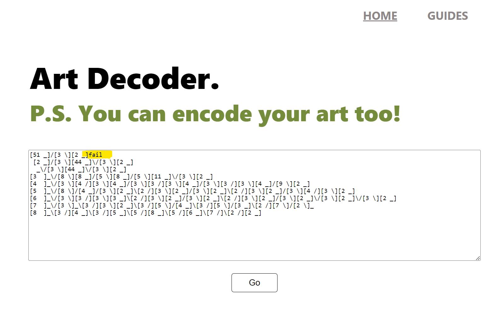

## **Art encoder-decoder with Go SSR and some HTMX and std Go packages only

Go encoding/decoding and SSR with HTMX.

[](https://www.youtube.com/watch?v=KhfJnG4f_H4)


### Starting, running, and using the web interface:
- Clone the repo & run go run the following command in terminal:

   ```
   go run server.go
   ```

- Server starts on port 8000 (http://localhost:8000/).
- Home page form takes input (both art and encoded), guesses the type, and processes accordingly.
- Terminal logs info and errors.
- If input is faulty, the errors and info to the user are sent up the call stack and shown to the user instead of the processed output - this give immediate usuable info to the user and is a solid uX consideration vs failing the user without any context.
- Guides page has instructions for the user.

### NB: Test case considerations:

- #### The POST /decoder endpoint returns HTTP202 for valid encoded strings:

   1. As I gathered, status code (sc) 202 is used for asynchronous processing where requet and processing are not part of the same request-response cycle, and sc 200 is used for synchonous quick processing, when request-response is part of one quick cycle. As in most cases, a 200 OK status code is used to indicate that the request was successfully received, understood, and processed.

   2. My program provides immediate feedback to the user, and the request-response cycle handles the entire operation in one go. Therefore, I have not forced a 202 asynchronous code - as the program runs synchronously and gives immediate feedback to the user.

- #### The POST /decoder endpoint returns HTTP400 for malformed encoded strings:

   1. The encoder project already features an UX improvement, where the user does not need to tell the program if they want to encode or decode ther input, as user should not be asked for info, if it can be clearly extrapolated (better UX). The program can also gracefully process malformed input and let the user know immediately, what is wrong with the encoded input vs stopping the program. I have used the same backend logic for the web interface

   2. This means that malformed input will not naturally produce a 400 error code, as malformed input does not stop the program. Instead it can process the malfomred input and let the user know hat is wrong with the input, which is way better UX.

   3. To still test the 404 malformed input logic, I have added a fail detection, which will produce a 404 error to terminal - To test this, just add the word "fail" to the first line of encoding - this will trigger a 400 error and log it to terminal (NB: It will not fail the network response which can be seen in Dev tools Network tab).

      

### Frontend build logic:
- HTMX is used for the art/encoding output processing, to give the page a SPA feel, where otput does not require a cluncky full page reload and processed output can be rendered in place of the form with a button to do another request, or to try again if there were any issues with the input.

   ```html
      <div id="main-content">
                  
            <div class="main-copy">
               <h1>Art Decoder.</h1>
               <h2>P.S. You can encode your art too!</h2>
            </div>
            
            <div class="form-area" id="form-swap">

               <form action="/decode" hx-post="/process-req/" hx-target="#form-swap">
      
                  <div class="main-input">
                        <textarea id="text-area" name="art-input" rows="15"></textarea>
                        <button id="go-button" type="submit">Go</button>
                  </div>
            
               </form>

            </div>

      </div>
   ```

- HTMX allows to swap out html content in kind of an AJAX-like fashion, where hard/clunky reloads are not needed.
- I decided not to use full SPA-like feel, for the Guides page, which is set up fully on its own - do avoid needing JS for controlling main navigation styling, as it would need keeping track of page state.
- There is basic responsiveness - if viewport width is less than 1200px, mobile/portrait mode is used.
- Styling is done with CSS
- Different from Art Decoder task, I have moved package main to the frontend, as this is the entry point to the program and backend code is now part of package backend.

## **Art encoder-decoder backend**

### General logic:
- Backend is based on Art encoder part 1 code where anything related to terminal has been removed.
- General flow for processing input is:

   1. Take user input.
   2. Use first line of input to guess if input is art or encoding.
   3. Based on that, send input to procesing.
   4. If input is deemed art, it is decoded.
   5. If input is deemed encoding, it is validated first and then decoded.
   6. during intial guessing/detection, there is no validation, but validation function is used for detection - based on regex - if input has any "[]" == encoding, if not == art.
